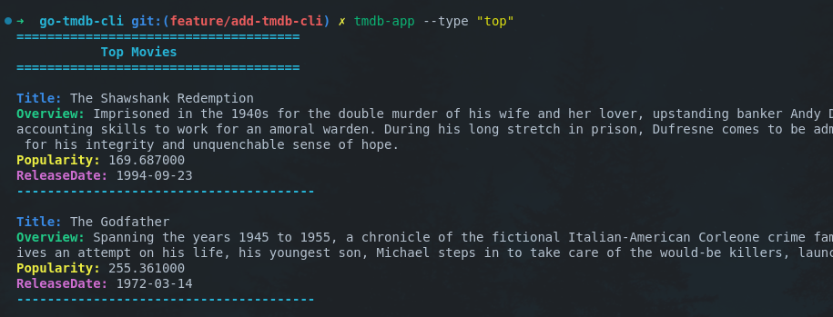

# TMDB CLI Tool


> Roadmap.sh Project URL: https://roadmap.sh/projects/tmdb-cli

A command-line tool for interacting with The Movie Database (TMDb) API

## How to run

- Install [go](https://go.dev/doc/install)

Clone the repository.

```bash
git clone https://github.com/pasindu-kavinda/backend-projects.git
cd backend-projects/go-tmdb-cli
```

Run the following command to install the required packages.
```bash
go mod download
``` 
Run the following command to run the application.
> You can replace `"playing"` with `"popular"`, `"top"`, or `"upcoming"`.
```bash
go run main.go --type "playing"
```

### Build the application
You build and run go applications
```bash
go build -o tmdb-app
```

Run the following command to run the application.
```bash
./tmdb-app --type "playing"
```

### Run the application globally
First build the application with `go build -o tmdb-app` command. Then run the following command to make available the application globally.
```bash
sudo mv tmdb-app /usr/local/bin/
```

Now you can run the application from anywhere.
```bash
tmdb-app --type "playing"
```

## Output


