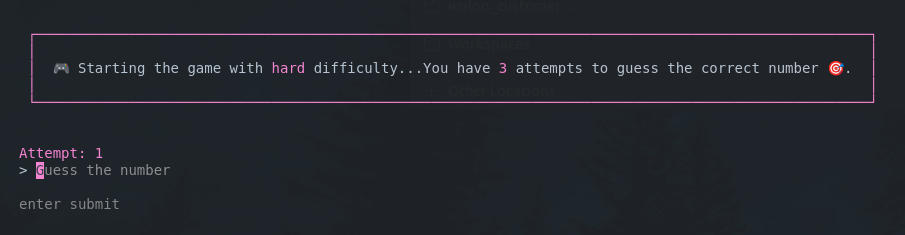
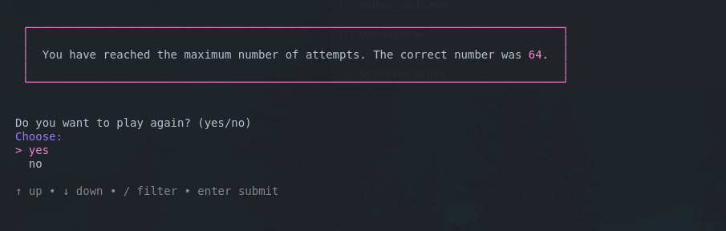

# Number Guessing Game


> Roadmap.sh Project URL: https://roadmap.sh/projects/number-guessing-game

## How to run

Clone the repository.

```bash
git clone https://github.com/pasindu-kavinda/backend-projects.git
cd backend-projects/number-guessing-game
```

> Make sure to set `guess-the-number.sh` as executable.
```bash
sudo chmod +x guess-the-number.sh
```

Run following commands to start game.

```bash
./guess-the-number.sh
```

> To exit the game, press `Ctrl+C`, When in input mode, type `exit`.

## Output

Start of the game.


Difficulty mode selection.
1. Easy (10 chances)
2. Medium (5 chances)
3. Hard (3 chances)








